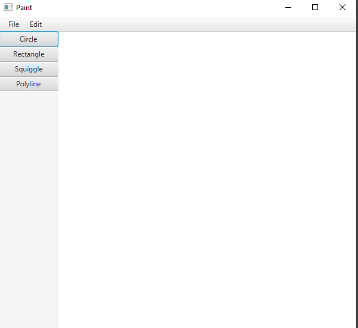
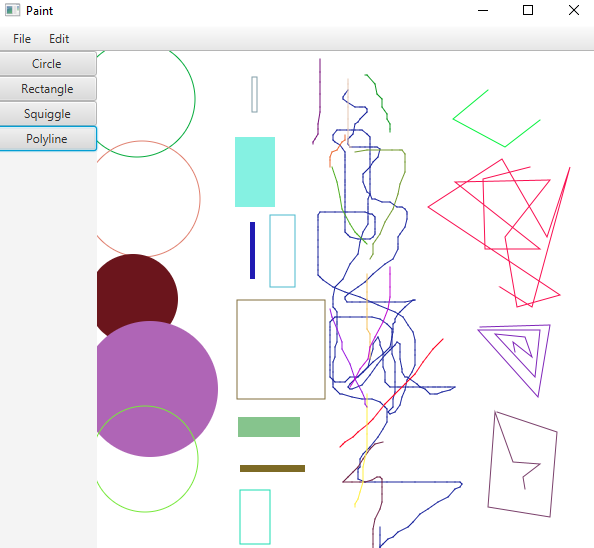

# PaintApp
MS Paint-like app that I made as part of my university software design course. Made using serveral design patterns such as:
- MVC
- Observer
- Factory
- Command
- Strategy

There are four drawing tools (look at the pictures for demos of each tool):
- Circle - Draws a circle.
- Rectangle - Draws a rectangle.
- Squiggle - Normal pencil tool to draw whatever you want with your mouse.
- Polyline - Draw a polygon using straight lines, use left click to draw a vertex of the polygon and use right click to end the shape.

Each tool uses random color and for circle and rectangle they are randomly filled/unfilled

There is also a save and load feature where you can save your paintings and load them in again to work on them. They are saved according to a specially made file format documented in paintSaveFileFormat.txt and are loaded in using a FSM file parser that I implemented.

## To run the app
This app runs on Java 1.8 so you would first need to install Java 1.8. You would also need to install JavaFX. Once you have those, import the project into eclipse and run Paint.java. Also, since it was developed on MacOS, run the app on MacOS for best performance. Also note that Circle isn't on by default when you run the app so you need to click a tool first to start drawing.

## Pictures
### Blank canvas

### Demo of each drawing tool (left to right: circle, rectangle, squiggle, polyline)

